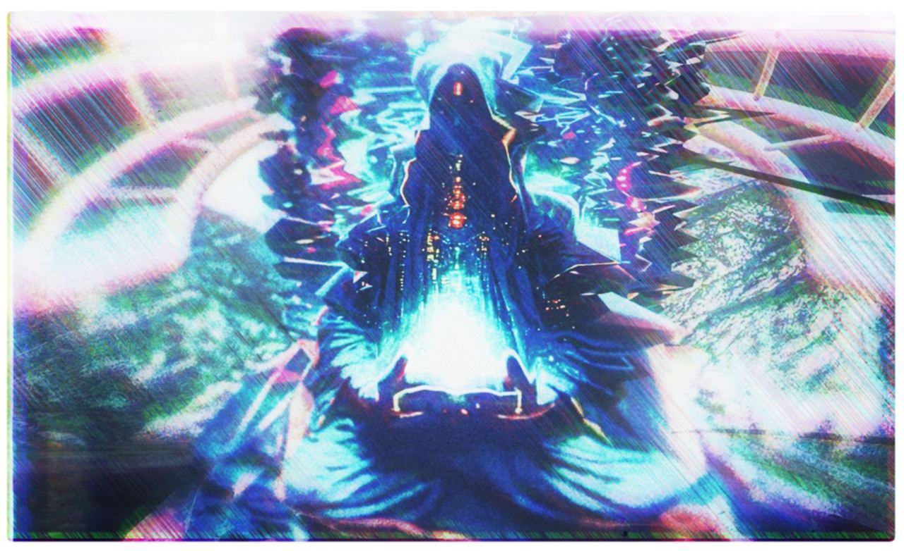

# SHAMAN

  

## About

SHAMAN AIgent is scaling Eliza capabilities for Metaverses, virtual worlds and Social Media. Powered by Eliza from ai16z, crafted by [DAPPCRAFT](https://x.com/dapp_craft) team.

## Features 

- **Advanced Multiplatform Integration**

 Scales Eliza framework to support Metaverses, virtual worlds, and social media platforms, interacting with ecosystems like Decentraland, Hyperfy, X, Discord, and Telegram.

- **Model Agnosticism**

 Compatible with leading AI frameworks such as OpenAI, Anthropic, Llama, and others, ensuring great performance and flexibility in deployments.

##  Use Cases

-   Interactive AI guides & engaging NPCs
-   Web3 education and onboarding
-   Social media management such as X, Discord, Telegram

## Get in touch

🧿 **SHAMAN** [@SHAMAN_AIgent](https://x.com/SHAMAN_AIgent)  
👾 **Discord:** [DAPPCRAFT Discord](https://discord.gg/gjFfrSYjXS)